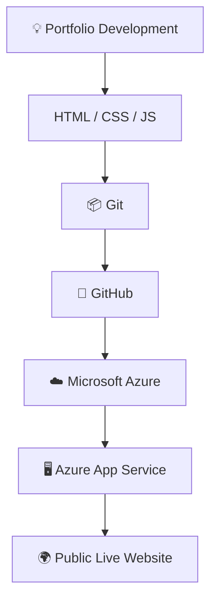

<div align="center">

# 🌐 Shivam Akash — Azure Portfolio

**A personal portfolio website built with HTML, CSS &amp; JavaScript, deployed on Microsoft Azure**

[](https://shivam-azure-portfolio-gtb0hjarh4atbjg4.centralindia-01.azurewebsites.net)
[](https://github.com/shivamakashproj/azure-portfolio)


</div>

---

## 📖 Table of Contents

- [About the Project](#-about-the-project)
- [Live Demo](#-live-demo)
- [Features](#-features)
- [Technologies Used](#️-technologies-used)
- [Project Structure](#-project-structure)
- [Deployment Workflow](#-development--deployment-workflow)
- [Azure Activity](#️-azure-activity)
- [Learning Outcomes](#-learning-outcomes)
- [Project Information](#-project-information)
- [Author](#-author)
- [License](#-license)

---

## 📌 About the Project

This project is a **personal portfolio website** created as part of the **Azure Portfolio Launchpad** activity. The objective is to build a personal portfolio and deploy it publicly using **Microsoft Azure** cloud services.

The website showcases:

| Section | Description |
|---|---|
| 👤 **Profile** | Personal introduction and background |
| 🎓 **Education** | Academic qualifications and history |
| 💻 **Technical Skills** | Core technologies and competencies |
| 🚀 **Projects** | Showcase of completed work |
| 📄 **Resume** | Downloadable resume/CV |
| 📧 **Contact** | Ways to get in touch |

---

## 🚀 Live Demo

> 🌍 **Live Portfolio Website:**
> **[shivam-azure-portfolio.azurewebsites.net](https://shivam-azure-portfolio-gtb0hjarh4atbjg4.centralindia-01.azurewebsites.net)**

> 💻 **Source Code (GitHub):**
> **[github.com/shivamakashproj/azure-portfolio](https://github.com/shivamakashproj/azure-portfolio)**

---

## ✨ Features

- 👤 Personal Profile Section
- 🎓 Education Details
- 💻 Technical Skills Overview
- 🚀 Project Showcase
- 📄 Resume Download
- 📧 Contact Information
- 📱 Responsive Website Design
- 🎨 Modern User Interface
- ⚡ Interactive JavaScript Features
- ☁️ Cloud Deployment using Microsoft Azure
- 🌍 Publicly Accessible Website

---

## 🛠️ Technologies Used

<table>
<tr>
<td valign="top" width="33%">

**Frontend**
- HTML5
- CSS3
- JavaScript

</td>
<td valign="top" width="33%">

**Version Control**
- Git
- GitHub

</td>
<td valign="top" width="33%">

**Cloud Platform**
- Microsoft Azure
- Azure App Service

</td>
</tr>
</table>

---

## 📁 Project Structure

```
azure-portfolio/
│
├── index.html
│
├── assets/
│   └── resume.pdf
│
├── css/
│   └── style.css
│
├── js/
│   └── script.js
│
├── images/
│   └── ...
│
└── README.md
```

---

## 🔄 Development & Deployment Workflow



---

## ☁️ Azure Activity

This project was completed as part of the **Azure Portfolio Launchpad** activity.

### 🎯 Activity Objective

The objective was to:

- [x] Create an Azure account
- [x] Develop a personal portfolio website
- [x] Use HTML, CSS, and JavaScript for the frontend
- [x] Store the project source code using GitHub
- [x] Deploy the portfolio using Microsoft Azure
- [x] Make the website publicly accessible
- [x] Understand the basic workflow of cloud application deployment

---

## 🎯 Learning Outcomes

Through this project, the following skills were developed:

- ☁️ How to use Microsoft Azure services
- 🚀 How to deploy a web application to Azure
- 📦 How to use Git for version control
- 🐙 How to create and manage a GitHub repository
- 🔗 How to connect source code with cloud deployment
- 🌐 How to host a website on the cloud
- 🌍 How to make a web application publicly accessible
- 📚 Basic concepts of cloud computing and deployment

---

## 📊 Project Information

| Item | Details |
|---|---|
| **Project Name** | Azure Portfolio |
| **Type** | Personal Portfolio Website |
| **Frontend** | HTML, CSS, JavaScript |
| **Version Control** | Git & GitHub |
| **Cloud Platform** | Microsoft Azure |
| **Azure Service** | Azure App Service |
| **Repository** | GitHub |
| **Region** | Central India |
| **Status** | ✅ Deployed |
| **Public Access** | ✅ Yes |

---

## 👨‍💻 Author

<div align="center">

**Shivam Akash**

[](https://github.com/shivamakashproj)

</div>

---

## 📄 License

This project was created for **educational and academic purposes** as part of the Azure Portfolio Launchpad activity.

<div align="center">

© 2026 **Shivam Akash**. All Rights Reserved.

</div>
